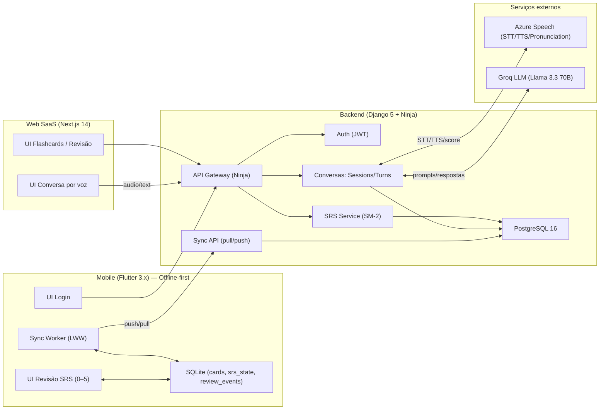

# Tech Specs — SpeakFlow

## 0) Objetivo e escopo técnico

O SpeakFlow é um mini ecossistema educacional de inglês com:
- **Tutor de voz conversacional com IA (web)**: STT/TTS + avaliação de pronúncia + feedback.
- **Flashcards + SRS (web)**: criação assistida de cards e revisões com SM-2.
- **App mobile Flutter (projeto separado)**: revisão offline-first com sincronização básica.

Este documento define decisões arquiteturais, modelo de dados e fluxos críticos, visando **MVP implementado**, **baixo custo** (free tiers) e **evolução incremental**.

## 1) Decisões de arquitetura (com justificativas)

### 1.1 Separação por superfícies (Web vs Mobile)
- **Web (Next.js)** concentra o fluxo de conversa por voz, dashboard e gestão de flashcards.
- **Mobile (Flutter)** atua como **projeto independente** para revisão SRS offline-first.

**Justificativa**: reduz escopo do mobile, garante entrega do MVP web, e mantém o mobile como extensão focada.

### 1.2 Backend monolítico modular (Django 5 + Ninja)
- Django serve como **núcleo de domínio** (usuário, sessões, cards, revisões).
- Django Ninja oferece **APIs tipadas e rápidas** (OpenAPI), adequadas para web e mobile.
- **Models implementados**: User, VoiceSession, SessionMessage, FlashCard, ReviewLog.

**Justificativa**: alta produtividade, ecossistema maduro, boa integração com Postgres, e simplicidade operacional no Railway.

### 1.3 Postgres como fonte de verdade + SQLite no mobile
- **Postgres 16** é o **source of truth** para web.
- **SQLite** no Flutter para funcionamento offline das revisões.
- **Sincronização**: API REST para pull/push de dados entre mobile e backend.

**Justificativa**: Postgres é robusto para SaaS; SQLite é padrão para offline-first.

### 1.4 Integrações externas (Azure Speech + Groq)
- **Azure Speech SDK** para STT/TTS e Pronunciation Assessment (limitado ao free tier).
- **Groq API (Llama 3.3 70B)** para geração de respostas do tutor e geração de feedback/itens sugeridos para cards.

**Justificativa**: melhor custo/benefício no MVP (free tiers), baixa latência (Groq) e serviços prontos (Azure).

### 1.5 Contratos estáveis e observabilidade
- APIs versionadas (ex.: `/api/v1/...`) e payloads estáveis.
- **Schemas Django Ninja**: Tipagem forte para requests/responses.
- Logs estruturados e métricas básicas (latência, erros por serviço).

**Justificativa**: integrações STT/TTS/LLM são fontes comuns de instabilidade; instrumentação reduz tempo de debug.

### 1.6 SRS: SM-2 implementado
- Algoritmo SM-2 implementado em Python no backend (models.py).
- **FlashCard model**: campos easiness_factor, interval_days, repetitions, next_review_at.
- **ReviewLog model**: histórico de revisões com quality_score e new_interval.

**Justificativa**: algoritmo simples, determinístico e comprovado; implementação direta nos models Django.

## 2) Diagrama de componentes (Mermaid)

## 3) Modelo de dados (tabelas principais)

> Tipos seguem convenções Postgres. Em Django: `UUIDField`, `TextField`, `JSONField`, `DateTimeField`, etc.

### 3.1 Autenticação e usuários

#### `User` (Django AbstractUser)
- `id` **int** (PK, auto-increment)
- `username` **varchar(150)** (unique)
- `email` **varchar(254)** (unique)
- `password` **varchar(128)** (hash)
- `level` **varchar(16)** (default "basic")
- `streak_days` **int** (default 0)
- `total_sessions` **int** (default 0)
- `is_active` **boolean** (default true)
- `created_at` **datetime** (auto_now_add)
- `updated_at` **datetime** (auto_now)

### 3.2 Conversas (sessões e mensagens)

#### `VoiceSession`
- `id` **int** (PK, auto-increment)
- `user_id` **int** (FK → User.id)
- `topic` **varchar(64)** (ex.: `job_interview`, `daily_meeting`, `airport`, `restaurant`, `small_talk`)
- `started_at` **datetime** (auto_now_add)
- `ended_at` **datetime** (nullable)
- `total_messages` **int** (default 0)

#### `SessionMessage`
- `id` **int** (PK, auto-increment)
- `session_id` **int** (FK → VoiceSession.id)
- `role` **varchar(16)** (`user|assistant`)
- `text` **textfield**
- `audio_url` **urlfield** (blank, default "")
- `pronunciation_score` **jsonfield** (default dict, blank)
- `created_at` **datetime** (auto_now_add)

#### `pronunciation_assessments`
- `id` **uuid** (PK)
- `turn_id` **uuid** (FK → conversation_turns.id, unique por turno do usuário)
- `provider` **varchar(32)** (default `azure`)
- `overall_score` **numeric(5,2)** (0–100)
- `accuracy_score` **numeric(5,2)** (nullable)
- `fluency_score` **numeric(5,2)** (nullable)
- `completeness_score` **numeric(5,2)** (nullable)
- `prosody_score` **numeric(5,2)** (nullable)
- `raw` **jsonb** (payload bruto para auditoria)
- `created_at` **timestamptz**

### 3.3 Flashcards e SRS

#### `FlashCard`
- `id` **int** (PK, auto-increment)
- `user_id` **int** (FK → User.id)
- `front` **textfield** (prompt)
- `back` **textfield** (resposta)
- `easiness_factor` **floatfield** (default 2.5)
- `interval_days` **intfield** (default 1)
- `repetitions` **intfield** (default 0)
- `next_review_at` **datetime** (default now)
- `created_from_session_id` **int** (FK → VoiceSession.id, nullable)
- `created_at` **datetime** (auto_now_add)
- `updated_at` **datetime** (auto_now)

#### `ReviewLog`
- `id` **int** (PK, auto-increment)
- `flashcard_id` **int** (FK → FlashCard.id)
- `reviewed_at` **datetime** (auto_now_add)
- `quality_score` **smallintfield**
- `new_interval` **intfield**

### 3.4 Índices e Performance

#### Índices implementados
- `VoiceSession`: indexes em `["user", "started_at"]` e `["topic"]`
- `SessionMessage`: indexes em `["session", "created_at"]` e `["role"]`
- `FlashCard`: index em `["user", "next_review_at"]`
- `ReviewLog`: index em `["flashcard", "reviewed_at"]`

## 4) Fluxo completo da sessão de voz (Web)

### 4.1 Objetivo do fluxo
Garantir uma experiência de conversa fluida, mitigando latência com estados visuais (“Ouvindo…”, “Transcrevendo…”, “Pensando…”), mantendo o feedback detalhado colapsado por padrão e permitindo replay do último áudio do tutor.

### 4.2 Sequência ponta a ponta (mensagem do usuário)
1. **UI (Web)** inicia gravação de áudio (WebAudio/MediaRecorder).
2. UI encerra gravação e envia áudio (ou referência) ao backend.
3. **Backend → Azure STT**:
   - transcreve áudio em texto.
   - retorna texto transcrito.
4. **Backend → Azure Pronunciation Assessment** (no mesmo áudio):
   - retorna scores e payload bruto.
   - persiste em `SessionMessage.pronunciation_score` (JSONField).
5. **Backend → Groq LLM**:
   - monta prompt com contexto (tema, nível, histórico curto da sessão).
   - gera:
     - resposta do tutor,
     - feedback resumido + correções,
     - sugestões de termos/frases para cards (criação assistida).
6. **Backend → Azure TTS**:
   - converte resposta do tutor em áudio.
7. **Backend** persiste:
   - `SessionMessage` (usuário e tutor),
   - atualiza `VoiceSession.total_messages`.
8. **UI (Web)** renderiza:
   - transcrição do usuário,
   - resposta do tutor (texto) + áudio com botão **Replay**,
   - feedback (colapsado por padrão).

### 4.3 Considerações de performance
- **Batching**: sempre que possível, fazer STT + Pronunciation no mesmo request/config.
- **Timeouts**: limites agressivos e fallback para texto sem áudio.
- **Cache**: não recomendado para TTS por ser conteúdo dinâmico; apenas para vozes/configurações.

## 5) Estratégia de autenticação (JWT)

### 5.1 Fluxo
- **Login** (username/senha) retorna:
  - `access_token` (JWT curto, ex.: 15 min)
  - `refresh_token` (opcional, ex.: 30 dias) com rotação e revogação
- Requests autenticados incluem `Authorization: Bearer <access_token>`.
- **Implementação**: Django Ninja schemas `LoginIn`, `TokenOut`.

### 5.2 Claims recomendadas
- `sub`: user id (int)
- `username`
- `email`
- `iat`, `exp`
- `jti`: id do token (para revogação/rotação)

### 5.3 Armazenamento por cliente
- **Web**: preferir cookie `HttpOnly` para refresh e access via mecanismo seguro (ou access em memória).
- **Mobile**: armazenar tokens com `flutter_secure_storage`.

### 5.4 Endpoints (exemplo)
- `POST /api/v1/auth/login`
- `POST /api/v1/auth/refresh` (se aplicável)
- `POST /api/v1/auth/logout` (revoga refresh)

## 6) Estratégia de Mobile (Projeto Separado)

### 6.1 Status Atual
- **Localização**: `/dev/SpeakFlow_Mobile/`
- **Independência**: Projeto Flutter separado com próprio pubspec.yaml
- **Funcionalidades**: Login, revisão SRS offline, sincronização básica
- **Integração**: API REST com backend Django

### 6.2 Arquitetura Mobile
- **State Management**: Flutter Riverpod
- **Storage Local**: SQLite para cards e revisões
- **HTTP Client**: Dio para comunicação com backend
- **Secure Storage**: flutter_secure_storage para tokens

### 6.3 Limitações Atuais
- Sem sincronização offline-first avançada
- Sem resolução de conflitos LWW implementada
- Funcionalidades básicas de SRS apenas

## 7) Variáveis de ambiente necessárias

### 7.1 Backend (Django)
- **Core**
  - `DJANGO_SECRET_KEY`
  - `DJANGO_DEBUG` (`true|false`)
  - `DJANGO_ALLOWED_HOSTS` (csv)
  - `DATABASE_URL` (Railway/Local)
  - `CORS_ALLOWED_ORIGINS` (csv)
  - `CSRF_TRUSTED_ORIGINS` (csv)
- **JWT**
  - `JWT_SIGNING_KEY` (ou reutilizar secret key com rotação planejada)
  - `JWT_ACCESS_TTL_MINUTES` (ex.: 15)
  - `JWT_REFRESH_TTL_DAYS` (ex.: 30, se usar refresh)
- **Groq**
  - `GROQ_API_KEY`
  - `GROQ_MODEL` (ex.: `llama-3.3-70b-versatile` — ajustar ao nome real usado)
- **Azure Speech**
  - `AZURE_SPEECH_KEY`
  - `AZURE_SPEECH_REGION`
  - `AZURE_SPEECH_LANGUAGE` (ex.: `en-US`)
  - `AZURE_SPEECH_VOICE` (ex.: `en-US-JennyNeural`)
- **Observabilidade (mínimo)**
  - `LOG_LEVEL` (ex.: `INFO`)

### 7.2 Frontend Web (Next.js)
- `NEXT_PUBLIC_API_BASE_URL`
- `NEXT_PUBLIC_APP_ENV` (`local|staging|prod`)
- (se necessário) `NEXT_PUBLIC_AZURE_SPEECH_REGION` (preferir que STT/TTS seja via backend no MVP)

### 7.3 Mobile (Flutter)
- `API_BASE_URL` (via build config/flavors)
- `APP_ENV`

### 7.4 Docker Compose (local)
- `POSTGRES_DB`, `POSTGRES_USER`, `POSTGRES_PASSWORD`
- `DATABASE_URL` apontando para o container

## 8) Riscos técnicos e mitigações

### 8.1 Limites do free tier (Azure Speech 5h/mês)
- **Risco**: consumo rápido por usuários ativos; falhas por quota.
- **Mitigação**:
  - limitar minutos/turnos por dia no plano free,
  - caching de configurações, timeouts agressivos,
  - fallback para modo texto (sem TTS) quando quota/erro.

### 8.2 Latência end-to-end (STT + LLM + TTS)
- **Risco**: conversa “parece lenta”, reduz retenção.
- **Mitigação**:
  - loaders explícitos (“Ouvindo…/Transcrevendo…/Pensando…”),
  - streaming onde possível (texto primeiro, áudio depois),
  - feedback detalhado colapsado por padrão,
  - medir P50/P95 e otimizar hotspots.

### 8.3 Qualidade variável de STT/pronúncia (ruído, sotaque, microfone)
- **Risco**: frustração e feedback incorreto.
- **Mitigação**:
  - instruções de microfone/ambiente,
  - permitir repetir turno,
  - apresentar score com faixas e disclaimers (“pode variar com ruído”).

### 8.4 Consistência do SM-2 entre mobile (local) e backend
- **Risco**: divergência de estado e agendamento.
- **Mitigação**:
  - tratar revisões como **eventos** (review_events) e recomputar estado no backend,
  - LWW baseado em `reviewed_at`,
  - testes de contrato (mesmos parâmetros/limites do SM-2).

### 8.5 Sync offline e duplicação de eventos (Futuro)
- **Risco**: eventos duplicados ou perdidos em reconexões instáveis.
- **Mitigação** (planejada para versão mobile avançada):
  - idempotência com `client_event_id`,
  - retornos por item no push,
  - backoff exponencial no worker.

### 8.6 Custos e limites do Railway (free tier)
- **Risco**: sleeping/latência cold start, limites de conexão.
- **Mitigação**:
  - endpoints leves, conexões DB eficientes,
  - healthcheck e warmup simples,
  - landing page integrada ao frontend (página pública em /).

### 8.7 Segurança (JWT, CORS, armazenamento de tokens)
- **Risco**: vazamento de token e acesso indevido.
- **Mitigação**:
  - TTL curto para access token,
  - refresh token rotativo + revogação,
  - armazenamento seguro no mobile,
  - CORS/CSRF configurados corretamente.

